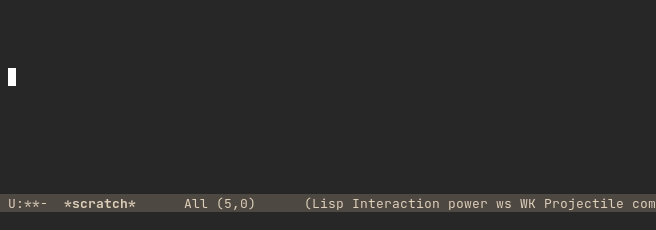

# power-mode.el

At long last, [Power Mode](https://github.com/codeinthedark/awesome-power-mode)
is available for the best text editor.



(It looks way better than in the gif, trust me.)

## Installation

Currently, this package is not on M?ELPA. In the meantime, please clone and
extend your load path. For example:

```elisp
(use-package power-mode
  :load-path "site-lisp/power-mode.el"
  :init
  (add-hook 'after-init-hook #'power-mode))
```

## Wow! How does it work?

[Giving me access to child frames was a
mistake.](https://www.youtube.com/watch?v=qPHMSBmdpCs)
